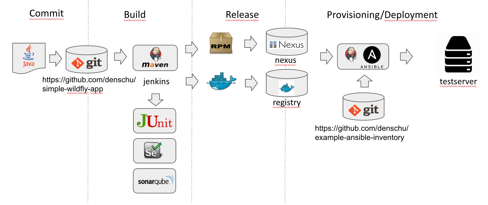

# Continuous Delivery Infrastructure

based on:
* Docker
* Jenkins
* Maven
* Ansible

related Git Repositories:
* Example Ansible Inventory: https://github.com/denschu/example-ansible-inventory
* CD Pipeline Ansible Inventory: https://github.com/denschu/cdpipeline-ansible-inventory
* Ansible Playbooks: https://github.com/denschu/ansible-playbooks
* Example Application: https://github.com/denschu/simple-wildfly-app
* Job DSLs: https://github.com/denschu/job-dsl-repository



## Install Tools

### Virtualization stuff

See [Vagrant Installation Docs](https://docs.vagrantup.com/v2/installation/) for other operating systems.

### Docker
See [Docker Toolbox](https://www.docker.com/docker-toolbox)

### Ansible
See [Ansible Docs](http://docs.ansible.com/ansible/intro_installation.html)

## Setup CD infrastructure based on Docker

### Mac OS X

Create default host for CD infrastructure
```shell
docker-machine create --driver virtualbox --virtualbox-memory "4096" --virtualbox-disk-size "40000" --engine-insecure-registry denschu.de default
```

Create separate host for the registry
```shell
docker-machine create --driver virtualbox --engine-insecure-registry denschu.de registry
```

### Linux
TODO

## Start the infrastructure locally

```shell
eval $(docker-machine env default)
docker-compose up
docker-compose -f docker-compose-registry.yml up -d
```

## Access Tools

| *Tool* | *Link* | *Credentials* |
| ------------- | ------------- | ------------- |
| Jenkins | http://${docker-machine ip default}:8080/jenkins/ | no login required |
| SonarQube | http://${docker-machine ip default}:9000/ | admin/admin |
| Artifactory | http://${docker-machine ip default}:8081/artifactory | admin/password |
| Bitbucket | http://${docker-machine ip default}:7990 | no login required |

## Setup example application host based on Vagrant

### Start testserver
```shell
cd testserver
vagrant up
```

### Setup ssh keys
```shell
ssh-keygen # Simply press enter to all questions
ssh-copy-id vagrant@192.168.50.92
or
cat ~/.ssh/id_rsa.pub | ssh vagrant@192.168.50.92 'umask 077; cat >>.ssh/authorized_keys'
ssh vagrant@192.168.50.92
exit
```

## Steps

The following steps are part of the generated Jenkins jobs.

### Build
Execute Build in Jenkins (includes compile, package, unit-tests)
```shell
mvn deploy docker:build
```

### Release
Execute Release in Jenkins (same as build with specific version number)
```shell
mvn build-helper:parse-version versions:set -DnewVersion=1.0.0
mvn deploy docker:build
mvn scm:tag docker:tag
```
### Deploy
```shell
ansible-playbook deployment.yml -i ../example-ansible-inventory/dev/inventory --extra-vars "NAME=simple-wildfly-app VERSION=latest"
```
### Test
Execute Selenium Tests with Jenkins

### Provision
optional step for new hosts!
```shell
ansible-playbook cdpipeline.yml -i ../cdpipeline-ansible-inventory/dev
ansible-playbook jboss.yml -i dev/inventory
```
